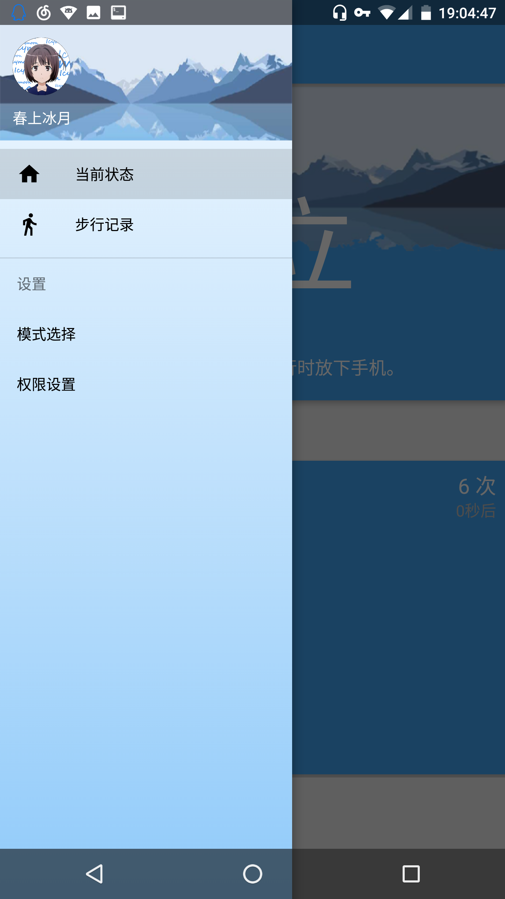
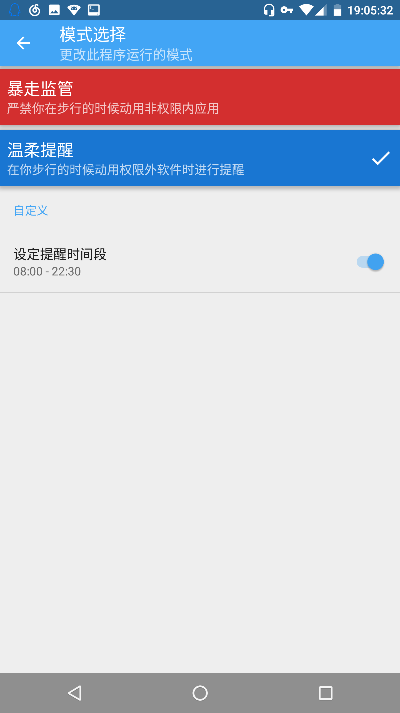

Walkee
---------
一款提醒你专心走路的应用

## 概览
当你一边走路一边使用手机时，本应用会提示你。

本项目暂时还只是「It just runs」阶段，仍然有不少地方有待优化。

## 贡献者
+ Olivia 提供了项目整体的创意以及用户界面的设计。
+ Haruue 负责程序的实现。
+ Wen JL 进行项目的市场调研以及其他的一些杂项工作。

## 感谢
+ [BasePedo](https://github.com/xfmax/BasePedo) 的作者 @xfmax ，他提供的计步算法为我们节省了很多工作。

## 屏幕截图




[查看更多...](design/Screenshots.md)

## 下载
https://github.com/haruue/Walkee/releases

## 开源协议
```License
Copyright 2016 Haruue Icymoon, Olivia

Licensed under the Apache License, Version 2.0 (the "License");
you may not use this file except in compliance with the License.
You may obtain a copy of the License at

    http://www.apache.org/licenses/LICENSE-2.0

Unless required by applicable law or agreed to in writing, software
distributed under the License is distributed on an "AS IS" BASIS,
WITHOUT WARRANTIES OR CONDITIONS OF ANY KIND, either express or implied.
See the License for the specific language governing permissions and
limitations under the License.

```
